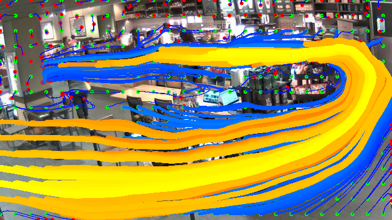

# APL Smart Campus Wait Time Estimation Update #1 
#### By: Nile Walker on 10/1/21

## Objective Recap:
* Given footage containing a queue in which people are waiting to reach an unspecified target location, identify the target location and estimate the amount of time it would take a person not currently present in the video to reach it through the queue.
## Assumptions:
* The footage is from a static camera.
* The target destinations of the queue is visible by the camera.
* An individual in the queue will remain visible for most if not all of their time waiting.
* The path that an individual travels in order to follow the queue won't change substantially over time.

## Current Problem to Solve:
### What Line?:
The amount of time it takes to get through a line is highly dependent on the amount of people in it but since the scenes are often full of people who are not waiting for the line and act as noise to the wait time problem. In order to effectively estimate how many people are in line we need a good measure where exactly this line is.

### Who's Left:
Somewhat related to the previous problem a queues wait time is not just dependent on how many people are in line but on how long it's taking people to complete their task once they've reached the target location. So in order to effectively estimate the wait time we need some measure of how long it's taking people to exit the target location.

## Current Solutions in Code:
### What Line?:

For this problem since we assume that the queues path doesn't change significantly over time. I've decided to simplify a queue to a region of regular motion. If individuals in a section of the frame tend to move forward and to the right we assume that the queue also follows that path since it holds the greatest influence over the most people in view.

While it would be useful to track each individuals path throughout the frame using current tools it is difficult to maintain a persons identity detection through the queue. Crowded scenes like these are particularly difficult for re-identification algorithms as they contain irregular motion, full/partial occlusions and often people with similar appearances. 


```Box: Starbucks Streams/2021_09_18-03:50:21_PM_to_2021_09_18-04:05:21_PM.mp4```

In order to get around this problem we normalize optical flow over several minutes of footage. This highlights areas of regular motion within the queue and allows noise or conflicting motion outside of the queue to eventually cancel out.


```This image can be genrerated while only tracking the motion of people throughout the frame, but the performance hasn't been significantly improved in my testing while also being slower and more sensitive to partial occlusions area so I haven't bothered with it here.```

In order to better leverage frame by frame motion we've discarded or ability to associate motion over the long term and have no idea of the actual path a person in frame might travel. So to get that back once we have this normalized optical flow image we treat it as a velocity field. This just meaning that for a point traveling through our field at any step t_n the position of the particle at t_n+1 is equal to the position_n + field[position_n].

By evenly distributing starting points throughout the field and sorting by their end length we’re able to get a measure of where the largest queue starts and stops.



```Further work can be done to cluster these paths together in order to get more representative segments but in the data available so far we can do without.```

### Who's Left:

Once the most prominent paths have been extracted for a scene we can use the first and final positions of those paths in order to block out starting and stopping regions. 


As a person detection passes through the start region with significant overlap we count that as a person who has entered the line and then the reverse for the stopping regions and exiting the line. This shortens the area in which we need to maintain an individuals identity and allows us to keep an estimate of how many people are in line.

By tracking the amount of time between people exiting the stopping region its possible to get a good measure of how long it's taking people to complete their tasks. This combined with an estimate of how many people have entered the line previously we're able to estimate wait times.
